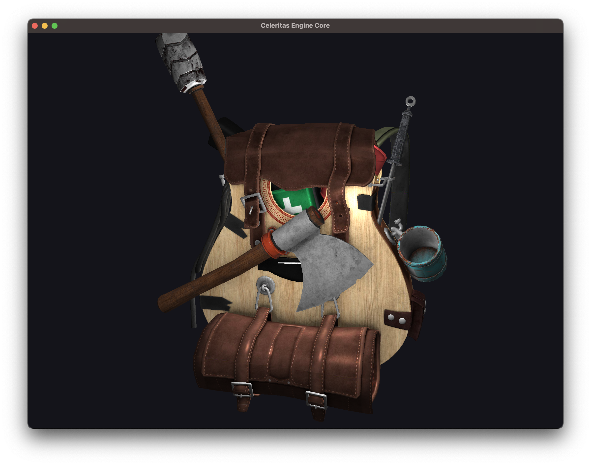

# celeritas-core

Not all files are fleshed out right now.

**Work-in-progress**: porting over code from old repository.

All third-party dependencies are licensed under their own license.

## Notes

* Check symbols in an 'archive' (static library)
    * `nm -C build/libcore.a`

* Generate compiler_commands.json
    * `xmake project -k compile_commands`

* Formatting
    * `xmake format`
    * Lint (no change) `find src/ -iname *.h -o -iname *.c | xargs clang-format --style=file --dry-run --Werror`
    * Format (edit in place) `find src/ \( -iname "*.h" -o -iname "*.c" \) | xargs clang-format -i --style=file`
        * `clang-format` must be installed!